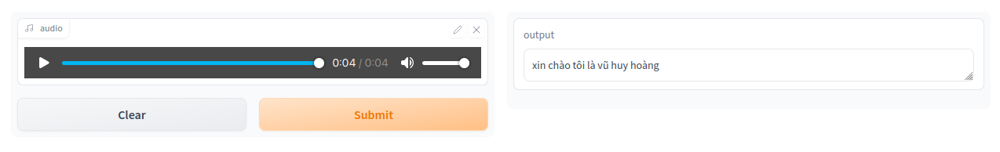

# Wav2Vec2 ASR
This repository contains a implementation of Wav2Vec2 and also provide codes for fine-tuning on [Wav2Vec2-base of Vietnamese](https://huggingface.co/nguyenvulebinh/wav2vec2-base-vi). <br>

**Demo is available at [Hugging Face](https://hoang1007-wav2vec2.hf.space)**


# Prepare Dataset
The code is fine-tunned on [VLSP2020 Dataset](https://institute.vinbigdata.org/events/vinbigdata-chia-se-100-gio-du-lieu-tieng-noi-cho-cong-dong/) <br>
Since I mainly train on Google Colab, so I need to convert this dataset to [Web Dataset](https://github.com/webdataset/webdataset) for faster loading from Google Drive
```bash
cd finetuning
python preprocess.py --data_dir [DATA_DIR] --dest_dir [DEST_DIR]
```
where:
- `DATA_DIR`: Path of the VLSP2020 data
- `DEST_DIR`: The directory where data is extracted in

# Fine-tuning
You can view my fine-tuning in [this notebook](./notebooks/finetuning.ipynb) and [WandB](https://wandb.ai/hoang1007/Wav2Vec2?workspace=user-hoang1007)
```bash
cd finetuning
python train.py \
    --batch_size 2 \
    --num_workers 2 \
    --classifier_lr 1e-4 \
    --wav2vec2_lr 1e-5 \
    --max_epochs 3 \
    --accelerator gpu
    --grad_clip 1.0
    --data_dir [DATA_DIR]
    --ckpt_dir [CKPT_DIR]
```
where:
- `DATA_DIR`: The directory that contains extracted data
- `CKPT_DIR`: The directory that checkpoint would be saved

# Inference
Please view [this notebook](./notebooks/test.ipynb)